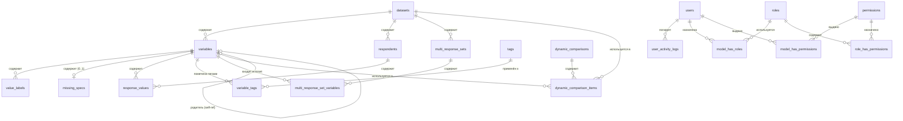

# Документация базы данных — SPSS Data Portal

## Обзор

PostgreSQL 16. Все первичные ключи — UUID (`uuid`). Схема использует паттерн **EAV (Entity-Attribute-Value)** для хранения ответов опросов, поскольку каждый опрос имеет динамический набор переменных, а колоночный подход потребовал бы `ALTER TABLE` при каждом импорте.

---

## ER-диаграмма (Mermaid)



---

## Справочник таблиц

### 1. Домен опросов (EAV)

#### `datasets`

Основная сущность для каждого импортированного SPSS-файла (.sav). У каждого опроса может быть несколько датасетов (версионированные импорты), но только один может быть активным в любой момент времени.

| Колонка | Тип | Описание |
|---------|-----|----------|
| `id` | uuid PK | |
| `code` | string | Код-идентификатор опроса |
| `title` | string | Название опроса |
| `description` | text, nullable | Описание опроса |
| `year` | integer, nullable | Год проведения опроса |
| `metadata` | jsonb, nullable | Произвольные метаданные из SPSS-файла |
| `file_name` | string | Оригинальное имя загруженного файла |
| `file_hash` | string | SHA-хеш файла (для дедупликации) |
| `file_label` | string, nullable | Метка файла SPSS |
| `file_encoding` | string, nullable | Кодировка символов .sav файла |
| `case_count` | integer, nullable | Количество наблюдений в SPSS-файле |
| `variable_count` | integer, nullable | Количество переменных |
| `spss_creation_date` | timestampTz, nullable | Дата создания .sav файла в SPSS |
| `weight_variable_name` | string, nullable | Имя весовой переменной (если есть) |
| `split_file_variables` | jsonb, nullable | Список переменных split-file в SPSS |
| `file_attributes` | jsonb, nullable | Атрибуты файла SPSS |
| `status` | string | Статус импорта (pending, processing, completed, failed) |
| `error_log` | text, nullable | Детали ошибки при неудачном импорте |
| `row_count_imported` | integer | Количество фактически импортированных строк |
| `version` | integer | Номер версии импорта |
| `is_active` | boolean | Только один активный датасет на код опроса |
| `timestamps` | | created_at, updated_at |

**Уникальность:** `(code, file_hash)` — предотвращает дублирование импортов одного файла.
**Индексы:** `(code, is_active)`, `year`.

---

#### `variables`

Одна строка на переменную на датасет. Хранит метаданные SPSS: имя, метку, тип, формат, уровень измерения.

| Колонка | Тип | Описание |
|---------|-----|----------|
| `id` | uuid PK | |
| `dataset_id` | uuid FK → datasets | CASCADE при удалении |
| `name` | string | Нормализованное имя переменной (lowercase, без пробелов) |
| `original_name` | string, nullable | Оригинальное имя из SPSS-файла |
| `label` | text, nullable | Метка переменной (может быть на кириллице) |
| `measure_level` | string, nullable | `nominal`, `ordinal` или `scale` |
| `spss_type` | string, nullable | Внутренний тип SPSS |
| `spss_format` | string, nullable | Формат отображения SPSS (например F8.2, A10) |
| `display_width` | integer, nullable | Ширина столбца при отображении |
| `decimals` | integer, nullable | Количество десятичных знаков |
| `alignment` | string, nullable | left, center, right |
| `role` | string, nullable | Роль переменной в SPSS (input, target и т.д.) |
| `position` | integer | Позиция столбца в оригинальном SPSS-файле |
| `is_weight` | boolean | Является ли весовой переменной |
| `is_computed` | boolean | Является ли вычисляемой переменной |
| `parent_variable_id` | uuid FK → variables, nullable | Ссылка на родителя (NULL при удалении родителя) |
| `variable_attributes` | jsonb, nullable | Атрибуты переменной SPSS |
| `timestamps` | | created_at, updated_at |

**Уникальность:** `(dataset_id, name)` — запрет дублирования имён переменных в одном датасете.
**Индексы:** `(dataset_id, position)`, `parent_variable_id`.

---

#### `value_labels`

Маппинг кодов в метки для каждой переменной. SPSS хранит числовые и строковые коды раздельно — таблица поддерживает оба типа.

| Колонка | Тип | Описание |
|---------|-----|----------|
| `id` | uuid PK | |
| `variable_id` | uuid FK → variables | CASCADE при удалении |
| `code_numeric` | float, nullable | Числовой код (например 1, 2, 3) |
| `code_string` | varchar(500), nullable | Строковый код (для строковых переменных) |
| `label` | string | Человекочитаемая метка (например «Мужской», «Женский») |
| `sort_order` | integer | Порядок отображения |
| `is_missing` | boolean | Обозначает ли эта метка пропущенное значение |
| `created_at` | timestampTz | |

**Check-ограничение:** `code_numeric IS NOT NULL OR code_string IS NOT NULL` — хотя бы один код обязателен.
**Частичные уникальные индексы:**
- `(variable_id, code_numeric)` WHERE `code_numeric IS NOT NULL`
- `(variable_id, code_string)` WHERE `code_string IS NOT NULL`

**Индекс:** `(variable_id, sort_order)`.

---

#### `missing_specs`

Пользовательские пропущенные значения переменной. SPSS поддерживает дискретные значения и диапазоны. Одна спецификация на переменную (связь 1:1).

| Колонка | Тип | Описание |
|---------|-----|----------|
| `id` | uuid PK | |
| `variable_id` | uuid FK → variables (unique) | CASCADE при удалении; **одна запись на переменную** |
| `missing_type` | string | Тип: `discrete`, `range`, `range_and_discrete` |
| `low` | float, nullable | Нижняя граница диапазона |
| `high` | float, nullable | Верхняя граница диапазона |
| `value1` | string, nullable | 1-е дискретное пропущенное значение |
| `value2` | string, nullable | 2-е дискретное пропущенное значение |
| `value3` | string, nullable | 3-е дискретное пропущенное значение |
| `created_at` | timestampTz | |

**Уникальность:** `variable_id` — ровно одна спецификация на переменную.

---

#### `respondents`

Одна строка на наблюдение (кейс) в SPSS-файле.

| Колонка | Тип | Описание |
|---------|-----|----------|
| `id` | uuid PK | |
| `dataset_id` | uuid FK → datasets | CASCADE при удалении |
| `case_number` | integer | Порядковый номер кейса (начинается с 1) |
| `external_id` | string, nullable | Внешний идентификатор респондента |
| `weight_value` | float, nullable | Вес респондента (из весовой переменной) |
| `created_at` | timestampTz | |

**Уникальность:** `(dataset_id, case_number)`.
**Индексы:** `dataset_id`, `(dataset_id, external_id)` WHERE `external_id IS NOT NULL`.

---

#### `response_values`

Основная EAV-таблица данных: одна строка на респондента на переменную. Самая большая таблица в системе.

| Колонка | Тип | Описание |
|---------|-----|----------|
| `id` | uuid PK | |
| `respondent_id` | uuid FK → respondents | CASCADE при удалении |
| `variable_id` | uuid FK → variables | CASCADE при удалении |
| `value_numeric` | float, nullable | Числовое значение |
| `value_string` | text, nullable | Строковое значение |
| `is_system_missing` | boolean | Флаг системного пропуска SPSS (SYSMIS) |

**Уникальность:** `(respondent_id, variable_id)` — одно значение на ячейку.
**Индексы:** `(variable_id, value_numeric)`, `(variable_id, is_system_missing)`, `respondent_id`.

> **Логика пропущенных значений:**
> - **Системный пропуск** (SYSMIS): `is_system_missing = true`, `value_numeric = NULL`
> - **Пользовательский пропуск**: хранится как реальное значение в `value_numeric`/`value_string`, исключается из валидных подсчётов через поиск в `missing_specs`
> - Оба типа исключаются из `valid_N` при аналитических расчётах

---

#### `multi_response_sets`

Определения множественных наборов ответов SPSS (дихотомия или категории).

| Колонка | Тип | Описание |
|---------|-----|----------|
| `id` | uuid PK | |
| `dataset_id` | uuid FK → datasets | CASCADE при удалении |
| `set_name` | string | Имя mrset в SPSS (например `$mrset1`) |
| `set_label` | string, nullable | Человекочитаемая метка |
| `set_type` | char(1) | `D` = дихотомия, `C` = категория |
| `counted_value` | string, nullable | Для дихотомии: значение, означающее «да» |
| `created_at` | timestampTz | |

**Уникальность:** `(dataset_id, set_name)`.

---

#### `multi_response_set_variables`

Связующая таблица: какие переменные входят в каждый множественный набор ответов.

| Колонка | Тип | Описание |
|---------|-----|----------|
| `id` | uuid PK | |
| `multi_response_set_id` | uuid FK → multi_response_sets | CASCADE при удалении |
| `variable_id` | uuid FK → variables | CASCADE при удалении |
| `position` | integer | Порядок переменной в наборе |

**Уникальность:** `(multi_response_set_id, variable_id)`.

---

### 2. Система тегов

#### `tags`

Пользовательские метки для организации переменных.

| Колонка | Тип | Описание |
|---------|-----|----------|
| `id` | uuid PK | |
| `name` | string (unique) | Название тега |
| `description` | text, nullable | Описание тега |
| `created_at` | timestampTz | |

#### `variable_tags`

Связь многие-ко-многим между переменными и тегами.

| Колонка | Тип | Описание |
|---------|-----|----------|
| `variable_id` | uuid FK → variables | CASCADE при удалении |
| `tag_id` | uuid FK → tags | CASCADE при удалении |

**Первичный ключ:** `(variable_id, tag_id)`.

---

### 3. Динамические сравнения

#### `dynamic_comparisons`

Именованные группы сравнений для кросс-датасетного/кросс-переменного анализа.

| Колонка | Тип | Описание |
|---------|-----|----------|
| `id` | uuid PK | |
| `name` | string | Название сравнения |
| `description` | text, nullable | Описание |
| `is_active` | boolean | Активность |
| `sort_order` | integer | Порядок сортировки |
| `timestamps` | | created_at, updated_at |

#### `dynamic_comparison_items`

Элементы сравнения: каждый ссылается на конкретную пару датасет + переменная.

| Колонка | Тип | Описание |
|---------|-----|----------|
| `id` | uuid PK | |
| `dynamic_comparison_id` | uuid FK → dynamic_comparisons | CASCADE при удалении |
| `dataset_id` | uuid FK → datasets | CASCADE при удалении |
| `variable_id` | uuid FK → variables | CASCADE при удалении |
| `sort_order` | integer | Порядок сортировки |
| `created_at` | timestampTz | |

**Уникальность:** `(dynamic_comparison_id, dataset_id, variable_id)`.

---

### 4. CMS-таблицы контента

Все контентные таблицы следуют общему паттерну: UUID первичный ключ, флаг `is_active`, `sort_order`, timestamps.

#### `publications`

| Колонка | Тип | Описание |
|---------|-----|----------|
| `id` | uuid PK | |
| `title` | string | Заголовок |
| `description` | text, nullable | Краткое описание |
| `content` | text, nullable | Полный текст (rich text) |
| `author` | string, nullable | Автор |
| `cover_image` | string, nullable | Путь к обложке |
| `file_path` | string, nullable | Путь к прикреплённому файлу (PDF и т.д.) |
| `external_url` | string, nullable | Внешняя ссылка |
| `published_at` | timestampTz, nullable | Дата публикации |
| `is_active` | boolean | Активность |
| `sort_order` | integer | Порядок сортировки |
| `timestamps` | | created_at, updated_at |

#### `reports`

Та же структура, что и `publications`, но без поля `author`.

#### `faqs`

| Колонка | Тип | Описание |
|---------|-----|----------|
| `id` | uuid PK | |
| `question` | string | Вопрос |
| `answer` | text | Ответ |
| `is_active` | boolean | Активность |
| `sort_order` | integer | Порядок сортировки |
| `timestamps` | | created_at, updated_at |

#### `support_tickets`

| Колонка | Тип | Описание |
|---------|-----|----------|
| `id` | uuid PK | |
| `subject` | string | Тема обращения |
| `message` | text | Текст обращения |
| `phone_or_email` | string | Контактные данные |
| `timestamps` | | created_at, updated_at |

---

### 5. Пользователи и аутентификация

#### `users`

| Колонка | Тип | Описание |
|---------|-----|----------|
| `id` | uuid PK | |
| `name` | string | Имя пользователя |
| `email` | string (unique) | Email |
| `email_verified_at` | timestamp, nullable | Дата подтверждения email |
| `password` | string | Хешированный пароль |
| `remember_token` | string, nullable | Токен «запомнить меня» |
| `timestamps` | | created_at, updated_at |

#### `personal_access_tokens` (Sanctum)

| Колонка | Тип | Описание |
|---------|-----|----------|
| `id` | uuid PK | |
| `tokenable_type` | string | Полиморфный тип (App\Models\User\User) |
| `tokenable_id` | uuid | Полиморфный FK |
| `name` | string | Название токена |
| `token` | char(64), unique | SHA-256 хеш токена |
| `abilities` | text, nullable | JSON-массив разрешений токена |
| `last_used_at` | timestamp, nullable | Последнее использование |
| `expires_at` | timestamp, nullable | Срок действия |
| `timestamps` | | created_at, updated_at |

---

### 6. Роли и разрешения (Spatie)

#### `roles`

| Колонка | Тип | Описание |
|---------|-----|----------|
| `id` | uuid PK | |
| `name` | string | Название роли |
| `guard_name` | string | Имя guard |
| `timestamps` | | |

**Уникальность:** `(name, guard_name)`.

#### `permissions`

| Колонка | Тип | Описание |
|---------|-----|----------|
| `id` | uuid PK | |
| `name` | string | Название разрешения |
| `guard_name` | string | Имя guard |
| `timestamps` | | |

**Уникальность:** `(name, guard_name)`.

#### Связующие таблицы

- **`model_has_roles`** — назначение ролей пользователям (полиморфно: `model_type` + `model_id`)
- **`model_has_permissions`** — прямое назначение разрешений пользователям
- **`role_has_permissions`** — назначение разрешений ролям

**Предустановленные роли:** `client`, `admin`.
**Предустановленные разрешения:** `page.users`, `page.publications`, `page.surveys`, `page.reports`, `page.datasets`, `page.faqs`, `page.data_ethics`, `page.about_platform`.

---

### 7. Логи активности пользователей

#### `user_activity_logs`

Отслеживание действий пользователей для аналитики и аудита.

| Колонка | Тип | Описание |
|---------|-----|----------|
| `id` | bigint PK (auto-increment) | Не UUID — оптимизирован для большого объёма записей |
| `user_id` | uuid FK → users | CASCADE при удалении |
| `type` | varchar(50) | Тип активности (например `login`, `analytics_run`) |
| `value` | string, nullable | Значение/детали активности |
| `metadata` | json, nullable | Дополнительные структурированные данные |
| `ip_address` | string, nullable | IP-адрес клиента |
| `timestamps` | | created_at, updated_at |

**Индексы:** `type`, `created_at`, `(user_id, type)`.

---

### 8. Инфраструктурные таблицы (Laravel)

| Таблица | Назначение |
|---------|------------|
| `password_reset_tokens` | Временные токены для сброса пароля |
| `sessions` | Серверные сессии (при использовании database-драйвера) |
| `cache` / `cache_locks` | Кеш приложения (при использовании database-драйвера) |
| `jobs` / `job_batches` / `failed_jobs` | Система очередей для фоновой обработки |

---

## Сводка связей

```
datasets (1) ──→ (N) variables ──→ (N) value_labels
                   │                 (0..1) missing_specs
                   │                 (N) variable_tags ←── tags
                   │                 (N) multi_response_set_variables
                   │                 (N) response_values
                   │
                   ├──→ (N) respondents ──→ (N) response_values
                   │
                   ├──→ (N) multi_response_sets ──→ (N) multi_response_set_variables
                   │
                   └──→ (N) dynamic_comparison_items ←── dynamic_comparisons

users ──→ roles (через model_has_roles)
      ──→ permissions (через model_has_permissions)
      ──→ user_activity_logs
```

## Каскадное поведение

Все внешние ключи домена опросов используют `CASCADE ON DELETE`. Удаление датасета удаляет все его переменные, респондентов, значения ответов, метки значений, спецификации пропусков, множественные наборы ответов и привязки тегов. Это сделано намеренно — версии импорта являются атомарными единицами.

Ссылка `parent_variable_id` (на саму себя) использует `NULL ON DELETE` — при удалении родительской переменной дочерние остаются, но теряют ссылку на родителя.
