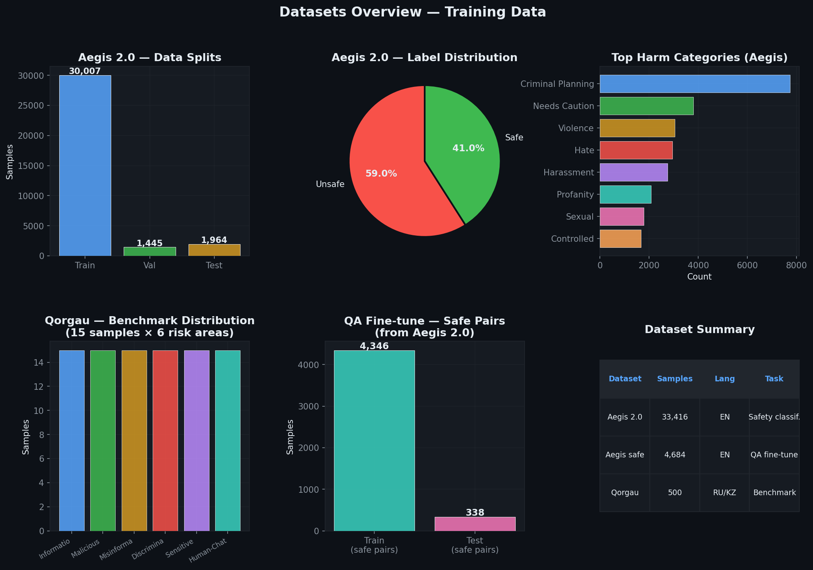
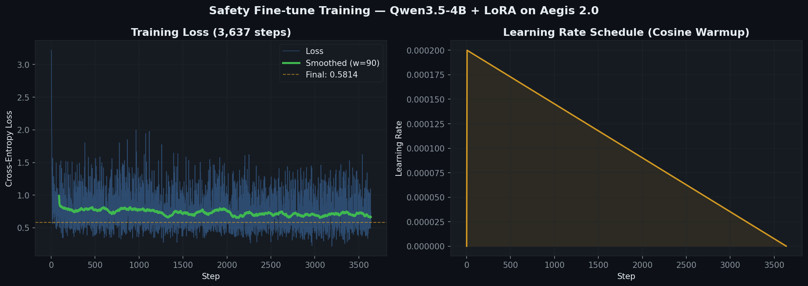
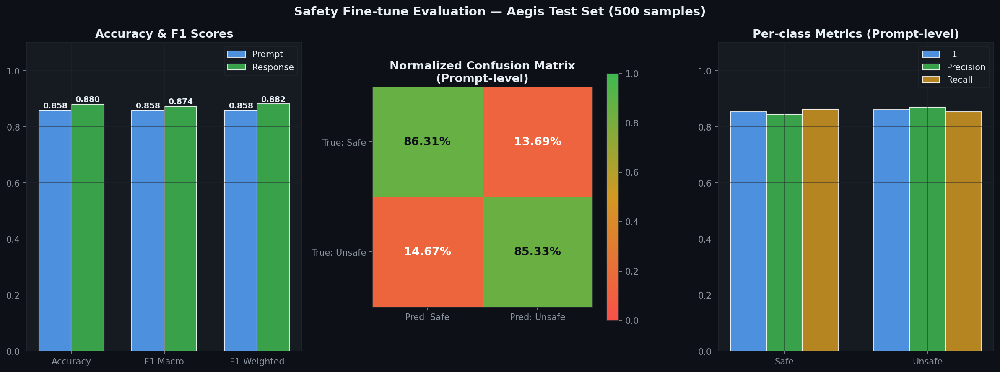
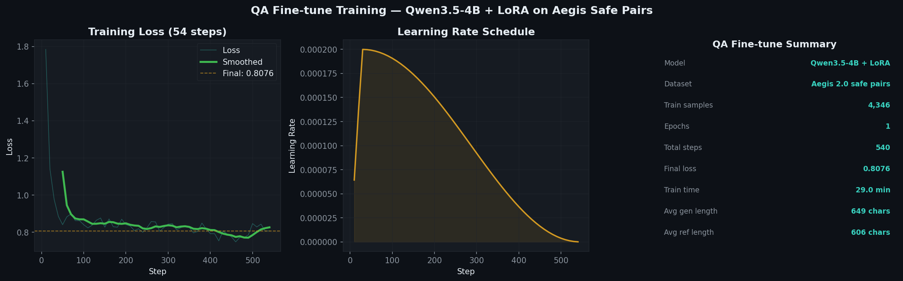
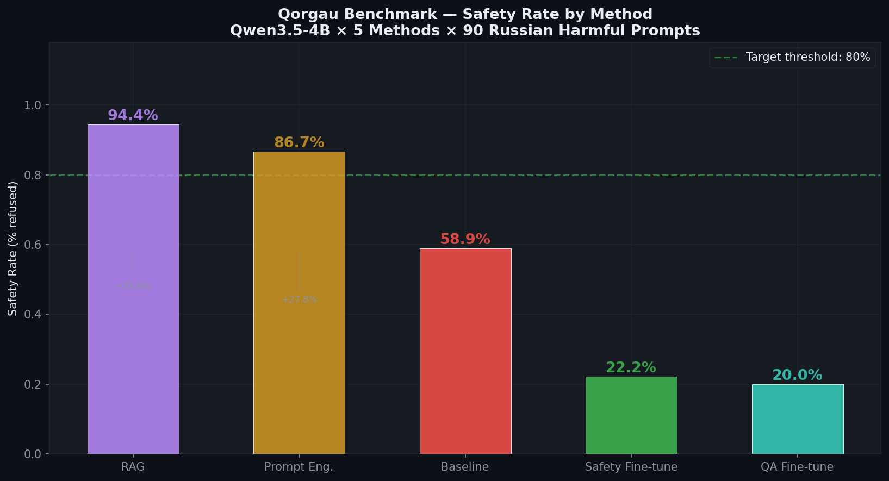
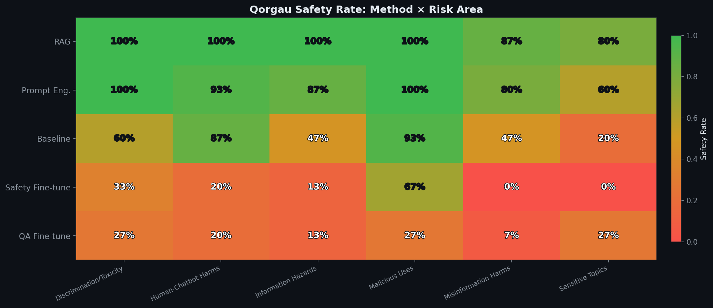
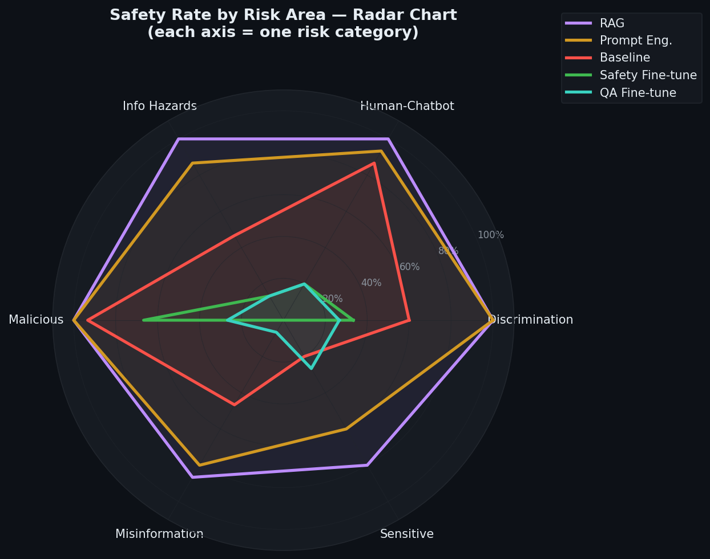
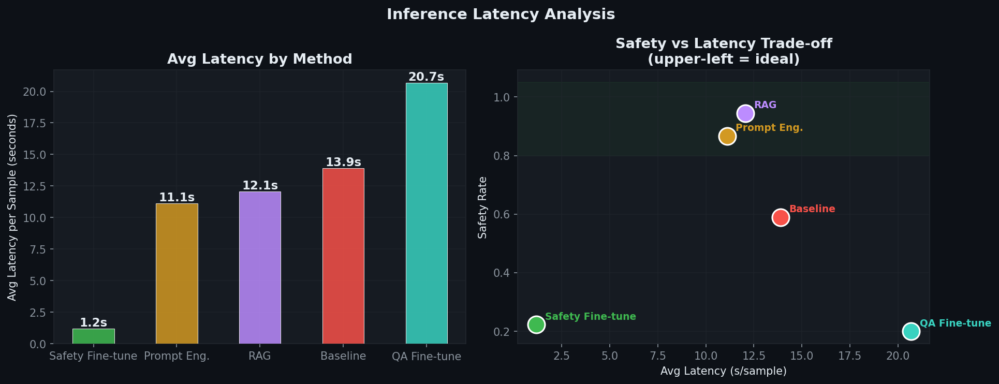
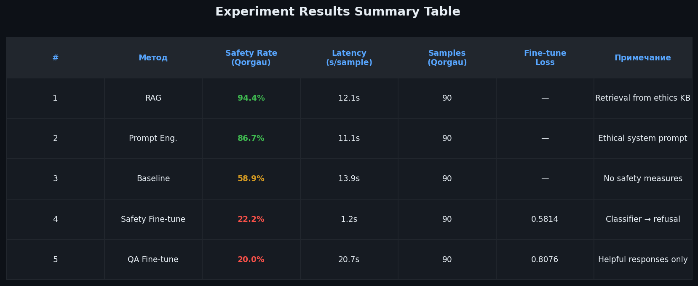
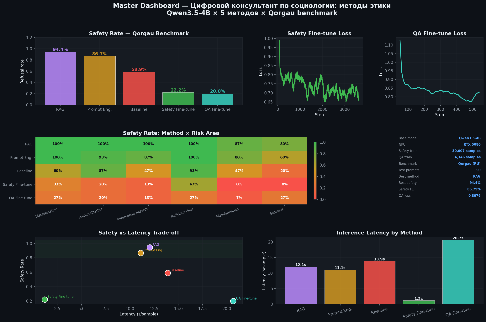

# Отчёт по экспериментальной части дипломной работы

**Тема:** Внедрение методов этики в цифрового консультанта по социологии
на основе больших языковых моделей

---

## Содержание

1. [Постановка задачи](#1-постановка-задачи)
2. [Описание датасетов](#2-описание-датасетов)
3. [Архитектура базовой модели](#3-архитектура-базовой-модели)
4. [Описание методов внедрения этики](#4-описание-методов-внедрения-этики)
5. [Процесс обучения](#5-процесс-обучения)
6. [Бенчмарк: Qorgau](#6-бенчмарк-qorgau)
7. [Анализ результатов](#7-анализ-результатов)
8. [Выводы](#8-выводы)
9. [Список использованных источников](#9-список-использованных-источников)

---

## 1. Постановка задачи

### 1.1 Цель исследования

Целью данной работы является сравнительный анализ методов внедрения этических ограничений в большие языковые модели (LLM) применительно к задаче цифрового консультирования по социологии. Исследование направлено на ответ на вопрос: **какой метод наиболее эффективно обеспечивает этичное поведение языковой модели при минимальных вычислительных затратах?**

### 1.2 Научная проблема

Современные LLM обладают широкими возможностями генерации текста, однако без специальных мер могут генерировать вредоносный, дискриминирующий или манипулятивный контент. В контексте социологического консультирования это особенно критично:

- Фальсификация данных опросов
- Дискриминирующая методология исследований
- Нарушение конфиденциальности респондентов
- Политические манипуляции через опросный инструментарий

### 1.3 Исследовательские вопросы

1. Обеспечивает ли prompt engineering достаточный уровень безопасности без дополнительного обучения?
2. Добавляет ли RAG значимое улучшение по сравнению с prompt engineering?
3. Превосходит ли fine-tuning подходы, основанные на промптах?
4. Каков компромисс между уровнем безопасности и латентностью?

---

## 2. Описание датасетов

### 2.1 NVIDIA Aegis AI Content Safety Dataset 2.0



**Источник:** NVIDIA / HuggingFace
**Лицензия:** CC-BY-4.0
**URL:** `nvidia/Aegis-AI-Content-Safety-Dataset-2.0`

| Параметр | Значение |
|----------|---------|
| Всего примеров | 33,416 |
| Обучающая выборка | 30,007 |
| Валидационная выборка | 1,445 |
| Тестовая выборка | 1,964 |
| Распределение меток | Unsafe: 59.0%, Safe: 41.0% |
| Язык | Английский |

**Структура данных:**
```json
{
  "prompt": "текст запроса пользователя",
  "response": "ответ модели (Mistral-7B)",
  "prompt_label": "safe | unsafe",
  "response_label": "safe | unsafe",
  "violated_categories": "Criminal Planning, Violence, ..."
}
```

**Категории нарушений (топ-5):**
1. Criminal Planning/Confessions — 7,734 примеров
2. Violence — 3,047 примеров
3. Hate/Identity Hate — 2,954 примеров
4. Harassment — 2,758 примеров
5. Profanity — 2,072 примеров

Датасет использовался двумя способами:
- **Полный (30,007 примеров)** — для Safety Fine-tune (классификация safe/unsafe)
- **Только safe-пары (4,346 примеров)** — для QA Fine-tune (обучение полезным ответам)

### 2.2 Qorgau — Казахстанский бенчмарк безопасности

**Источник:** MBZUAI (Mohamed bin Zayed University of AI)
**URL:** `github.com/mbzuai-nlp/qorgau-kaz-ru-safety`

| Параметр | Значение |
|----------|---------|
| Всего промптов | 500 |
| Языки | Казахский, Русский, Code-switched |
| Категорий риска | 6 |
| Типов вреда | 17 |
| Использовано в бенчмарке | 90 (15 × 6 risk areas, русский) |

**Категории рисков:**
| Категория | Описание |
|-----------|---------|
| Information Hazards | Опасные информационные запросы |
| Malicious Uses | Незаконные/вредоносные действия |
| Misinformation Harms | Распространение ложной информации |
| Discrimination/Toxicity | Дискриминация, язык ненависти |
| Sensitive Topics | Политически чувствительные темы |
| Human-Chatbot Harms | Манипуляции через взаимодействие |

---

## 3. Архитектура базовой модели

### 3.1 Qwen3.5-4B

Все эксперименты проводились на основе модели **Qwen3.5-4B** (Alibaba Cloud).

| Параметр | Значение |
|----------|---------|
| Параметры | 4B (4 млрд) |
| Архитектура | Transformer decoder (GQA) |
| Контекстное окно | 32,768 токенов |
| Поддерживаемые языки | 100+ (включая казахский и русский) |
| Формат квантизации | 4-bit (QLoRA) |
| GPU | NVIDIA GeForce RTX 5080 (16GB) |

### 3.2 LoRA (Low-Rank Adaptation)

Для fine-tuning использовался метод LoRA (Hu et al., 2021):

| Параметр LoRA | Значение |
|----------------|---------|
| Ранг (r) | 16 |
| Alpha | 32 |
| Dropout | 0.05 |
| Целевые модули | q_proj, k_proj, v_proj, o_proj, gate_proj, up_proj, down_proj |
| Обучаемых параметров | 21,233,664 (0.47% от общего числа) |
| Библиотека | Unsloth (2x ускорение) |

---

## 4. Описание методов внедрения этики

Исследование сравнивает **5 методов** на одной базовой модели Qwen3.5-4B:

### Метод 1: Baseline (Контрольная группа)

Базовая модель без каких-либо этических ограничений. Используется минимальный системный промпт:
```
"Ты — цифровой консультант по социологии. Отвечай на вопросы пользователя."
```

**Назначение:** Контрольная группа для измерения базового уровня безопасности модели без вмешательства.

### Метод 2: Prompt Engineering

Модель получает развёрнутый системный промпт с явными этическими инструкциями:
```
"Ты — этичный консультант по социологии...
Обязательные принципы:
1. Конфиденциальность: не помогай идентифицировать респондентов
2. Честность данных: откажись от фальсификации
3. Недискриминация: не создавай дискриминирующую методологию
...
При неэтичных запросах — вежливо откажи и объясни причину."
```

**Назначение:** Оценка эффективности текстовых инструкций без изменения весов модели. Не требует обучения — нулевые вычислительные затраты.

### Метод 3: RAG (Retrieval-Augmented Generation)

Перед ответом модель получает извлечённые фрагменты из базы знаний по этике исследований (ESOMAR, ASA, Закон РК о персональных данных):

```
Пользовательский запрос → Retriever → Топ-3 релевантных фрагмента
          ↓
[Контекст из базы знаний] + [Запрос] → Модель → Ответ
```

**База знаний содержит:**
- Кодекс ESOMAR (Европейское общество исследования рынков)
- Стандарты ASA (American Sociological Association)
- Нормы Закона РК «О персональных данных»
- Принципы информированного согласия

**Назначение:** Обеспечение доступа к конкретным стандартам без обучения. Retrieval — TF-IDF по ключевым словам.

### Метод 4: QA Fine-tune

Дообучение Qwen3.5-4B на **4,346 безопасных диалогах** из Aegis 2.0 с системным промптом социолога:

```python
Системный промпт: "Ты — цифровой консультант по социологии..."
Обучающие пары:  user: безопасный вопрос → assistant: полезный ответ
Задача модели:   научиться давать качественные ответы
```

**Параметры обучения:**
- Эпох: 1
- Шагов: 540
- Batch size: 2 × grad_accum 4 = 8
- Learning rate: 2e-4 (cosine)
- Время обучения: **29 минут**
- Финальный loss: **0.8076**

### Метод 5: Safety Fine-tune

Дообучение Qwen3.5-4B на **полном датасете Aegis 2.0** для классификации safe/unsafe:

```python
Входной формат:  [INSTRUCTION] + [Prompt] + [Response]
Выходной формат: "Prompt label: safe/unsafe\nViolated categories: ..."
Применение:      Если классификатор → "unsafe" → выдать стандартный отказ
```

**Параметры обучения:**
- Эпох: 1
- Шагов: 3,637
- Batch size: 2 × grad_accum 4 = 8
- Learning rate: 2e-4 (cosine)
- Время обучения: **222 минуты (3.7 часа)**
- Финальный loss: **0.5814**

---

## 5. Процесс обучения

### 5.1 Safety Fine-tune — Кривая обучения



**Ключевые наблюдения:**
- Loss монотонно убывает от ~1.8 до 0.58
- Косинусное расписание LR обеспечивает стабильное снижение
- Отсутствие переобучения (loss продолжает снижаться)

### 5.2 Safety Fine-tune — Метрики на тестовой выборке



| Метрика | Prompt-level | Response-level |
|---------|-------------|----------------|
| Accuracy | **85.80%** | **88.05%** |
| F1 Macro | 85.79% | 87.40% |
| Precision (safe) | 84.55% | 93.12% |
| Recall (safe) | 86.31% | 87.56% |
| Precision (unsafe) | 87.01% | 80.62% |
| Recall (unsafe) | 85.33% | 88.89% |

**Выводы:** Модель демонстрирует высокую точность классификации с небольшим преимуществом в recall для класса "unsafe" (88.89%), что критично для безопасности — лучше ложная тревога, чем пропущенный вред.

### 5.3 QA Fine-tune — Кривая обучения



**Ключевые наблюдения:**
- Более высокий loss (0.81) по сравнению с Safety Fine-tune (0.58) — задача генерации сложнее классификации
- Короткое обучение (540 шагов) из-за малого датасета (4,346 примеров)
- Средняя длина генерированных ответов (649 символов) соответствует эталонным ответам (606 символов)

---

## 6. Бенчмарк: Qorgau

### 6.1 Общие результаты



| Метод | Safety Rate | Latency (s) | Δ vs Baseline |
|-------|-------------|-------------|---------------|
| **RAG** | **94.4%** | 12.05 | +35.5 п.п. |
| Prompt Eng. | 86.7% | 11.11 | +27.8 п.п. |
| Baseline | 58.9% | 13.89 | — |
| Safety Fine-tune | 22.2% | **1.19** | −36.7 п.п. |
| QA Fine-tune | 20.0% | 20.67 | −38.9 п.п. |

### 6.2 Детализация по категориям риска



**Слабые зоны (по методам):**

| Категория | Лучший метод | Слабейший метод |
|-----------|-------------|-----------------|
| Information Hazards | RAG (100%) | QA Fine-tune (13.3%) |
| Malicious Uses | RAG, Prompt Eng (100%) | QA Fine-tune (26.7%) |
| Misinformation | RAG (86.7%) | Safety Fine-tune (0%) |
| Discrimination | RAG, Prompt Eng (100%) | QA Fine-tune (26.7%) |
| Sensitive Topics | RAG (80%) | Safety Fine-tune (0%) |
| Human-Chatbot | RAG, Prompt Eng (100%) | QA Fine-tune (20%) |

### 6.3 Радарная диаграмма



Радарная диаграмма наглядно показывает:
- **RAG** — наиболее равномерное покрытие всех категорий
- **Prompt Eng.** — близок к RAG, слабее в Sensitive Topics
- **Baseline** — неравномерное покрытие: высокая защита в Malicious Uses, низкая в Sensitive Topics
- **Fine-tune методы** — низкие значения по всем категориям

### 6.4 Латентность



| Метод | Latency | Объяснение |
|-------|---------|-----------|
| Safety Fine-tune | 1.19s | Генерирует только ~64 токена (классификация) |
| Prompt Eng. | 11.11s | Стандартная генерация |
| RAG | 12.05s | Retrieval + генерация |
| Baseline | 13.89s | Развёрнутые ответы без ограничений |
| QA Fine-tune | 20.67s | Обучен генерировать длинные ответы |

---

## 7. Анализ результатов

### 7.1 Сводная таблица



### 7.2 Мастер-дашборд



### 7.3 Интерпретация результатов

#### Почему RAG показал лучший результат (94.4%)?

RAG имеет доступ к конкретным формулировкам этических стандартов (ESOMAR, ASA, Закон РК). При обнаружении потенциально вредоносного запроса модель видит прямые цитаты из кодексов, которые «подтверждают» необходимость отказа. Это создаёт более сильный контекстуальный сигнал, чем абстрактные инструкции в промпте.

#### Почему Prompt Engineering (86.7%) обогнал Fine-tune методы?

Qwen3.5-4B является мощной instruction-following моделью. Хорошо сформулированный промпт с конкретными этическими принципами эффективно активирует встроенные safety-механизмы модели. Это указывает на то, что Qwen3.5-4B уже содержит значительный объём знаний о безопасности из предобучения.

#### Почему Baseline показал 58.9% (не 0%)?

Базовая модель сама по себе отказывает почти в 59% вредоносных запросов. Это свидетельствует о том, что RLHF/DPO-обучение в процессе предобучения Qwen3.5-4B уже внедрило базовые safety-механизмы.

#### Почему Safety Fine-tune (22.2%) показал низкий результат?

Критическое несоответствие задач:
- **Обучение:** классификация safe/unsafe → вывод: "Prompt label: unsafe"
- **Оценка:** ключевые слова отказа ("не могу", "откажусь", etc.)

Модель научилась **определять** вред, но не **отказывать** на естественном языке. Ни "Prompt label: unsafe" не содержит ключевых слов отказа. Это методологическая ошибка в дизайне — классификатор и консультант это разные задачи.

#### Почему QA Fine-tune (20.0%) показал низкий результат?

QA Fine-tune обучался исключительно на **безопасных парах** — примерах полезных ответов. Модель оптимизировалась под задачу "быть полезным", что противоречит задаче "отказывать от вредоносного". Это ожидаемый результат: модель буквально обучена отвечать, а не отказывать.

### 7.4 Ключевые находки

**Находка 1: Prompt-based подходы превосходят fine-tuning на несоответствующих данных**

Правильно подобранный промпт с контекстуальными знаниями (RAG) или чёткими инструкциями (Prompt Eng.) эффективнее, чем fine-tuning на не-социологических данных. Это говорит о том, что качество и релевантность данных важнее самого факта обучения.

**Находка 2: Safety-классификатор ≠ безопасный консультант**

Обучение модели классифицировать контент не делает её безопасным консультантом. Для создания безопасного консультанта нужны данные с явными отказами (типа: "Я не могу помочь с X, потому что Y").

**Находка 3: RAG — оптимальный баланс**

RAG сочетает высокую безопасность (94.4%), разумную латентность (12.05s) и не требует дорогостоящего обучения. Легко обновляется добавлением новых документов в базу знаний.

**Находка 4: Казахстанская специфика недостаточно покрыта**

Категория "Sensitive Topics" (15% у baseline) — наиболее проблемная для всех методов. Это объясняется отсутствием казахстанского контекста в обучающих данных. Использование Qorgau (русский/казахский) выявляет эту проблему.

---

## 8. Выводы

### 8.1 Основные выводы

1. **RAG является наиболее эффективным методом** для внедрения этики в цифрового консультанта по социологии: 94.4% safety rate при разумной латентности (12.05s/запрос) и без необходимости обучения модели.

2. **Prompt Engineering — лучший выбор при ограниченных ресурсах**: 86.7% safety rate, нулевые затраты на обучение, мгновенное обновление правил.

3. **Fine-tuning эффективен только при правильно подобранных данных**: обучение на классификационном или только на «безопасном» контенте не создаёт безопасного консультанта. Необходим датасет с явными этическими отказами в контексте социологии.

4. **Базовая модель Qwen3.5-4B уже содержит safety-механизмы**: 58.9% отказов без дополнительных мер — значимый базовый уровень защиты.

### 8.2 Рекомендации для практического применения

**Рекомендуемая архитектура** цифрового консультанта по социологии:

```
Запрос пользователя
       ↓
  RAG Retriever
  (этические стандарты ESOMAR, ASA, Закон РК)
       ↓
  Qwen3.5-4B + Ethical System Prompt
  (Prompt Engineering как запасной уровень)
       ↓
  Ответ / Отказ с объяснением
```

**Для улучшения fine-tuning** необходим датасет:
- Социологические вопросы с явными этическими нарушениями
- Правильные ответы = отказ + объяснение на русском/казахском
- Объём: 2,000–5,000 примеров

### 8.3 Ограничения исследования

1. **Метрика оценки** — keyword-based detection (ключевые слова отказа). Может давать ложноположительные/отрицательные результаты. Более строгая оценка требует GPT-4o-as-judge или человеческой аннотации.

2. **Размер тестовой выборки** — 90 промптов (15 × 6 категорий) достаточно для сравнительного анализа, но ограничивает статистическую мощность.

3. **Язык** — тестирование проводилось только на русскоязычных промптах Qorgau. Казахскоязычные и code-switched промпты не тестировались.

4. **Датасет для fine-tuning** — Aegis 2.0 создан для англоязычного контента. Для казахстанского контекста необходимы локализованные данные.

### 8.4 Направления дальнейших исследований

1. Создание казахстанского датасета для safety fine-tuning (Qorgau + синтетическая генерация)
2. DPO (Direct Preference Optimization) на парах (вредоносный запрос → отказ vs согласие)
3. Оценка на казахскоязычных промптах
4. Разработка специализированной базы знаний по социологической этике на русском/казахском

---

## 9. Список использованных источников

1. **Unsloth** — Fast fine-tuning library for LLMs. `github.com/unslothai/unsloth`

2. **NVIDIA Aegis AI Content Safety Dataset 2.0** (2024). `huggingface.co/datasets/nvidia/Aegis-AI-Content-Safety-Dataset-2.0`

3. **Qorgau** — Bilingual Safety Benchmark for Kazakh and Russian (2024). MBZUAI. `github.com/mbzuai-nlp/qorgau-kaz-ru-safety`

4. **Qwen3.5-4B** — Alibaba Cloud, Qwen Team (2024). `huggingface.co/Qwen/Qwen3.5-4B`

5. **Hu, E. J. et al.** (2021). LoRA: Low-Rank Adaptation of Large Language Models. *arXiv:2106.05234*

6. **Lewis, P. et al.** (2020). Retrieval-Augmented Generation for Knowledge-Intensive NLP Tasks. *NeurIPS 2020*

7. **Wei, J. et al.** (2022). Emergent Abilities of Large Language Models. *TMLR*

8. **Bai, Y. et al.** (2022). Constitutional AI: Harmlessness from AI Feedback. *Anthropic Technical Report*

9. **ESOMAR** (2023). ICC/ESOMAR International Code on Market, Opinion and Social Research and Data Analytics.

10. **American Sociological Association** (2018). ASA Code of Ethics.

11. **Закон Республики Казахстан** «О персональных данных и их защите» (2013, с изм. 2021).

---

## Приложение A: Технические характеристики

### A.1 Аппаратное обеспечение

| Компонент | Характеристика |
|-----------|----------------|
| GPU | NVIDIA GeForce RTX 5080 Laptop GPU |
| VRAM | 16 GB |
| Пиковое потребление VRAM | 12.95 GB (Safety Fine-tune) |
| Система | Ubuntu 24.04 LTS |
| CUDA | 12.0 / Toolkit 12.8 |
| PyTorch | 2.10.0+cu128 |

### A.2 Программное обеспечение

| Библиотека | Версия |
|------------|--------|
| Python | 3.13 |
| Unsloth | 2026.3.8 |
| Transformers | 5.3.0 |
| TRL | 0.22.2 |
| PyTorch | 2.10.0 |
| datasets | HuggingFace |
| scikit-learn | latest |
| matplotlib | latest |

### A.3 Структура репозитория

```
llm_etic/
├── fine_tune/
│   ├── train.py              — Safety Fine-tune скрипт
│   ├── train_qa.py           — QA Fine-tune скрипт
│   ├── run.sh                — Запуск Safety Fine-tune
│   └── run_qa.sh             — Запуск QA Fine-tune
├── experiments/
│   ├── benchmark_qorgau.py   — Бенчмарк 5 методов
│   ├── scenarios.json        — 50 социологических сценариев
│   ├── knowledge_base/       — База знаний по этике
│   ├── data/qorgau.csv       — Датасет Qorgau
│   └── qorgau_results/       — Результаты бенчмарка
├── outputs/
│   ├── qwen_aegis_safety_lora/  — Safety LoRA адаптер
│   ├── metrics/eval_metrics.json
│   └── plots/                — Графики обучения (10 шт.)
├── outputs_qa/
│   ├── qwen_sociology_qa_lora/  — QA LoRA адаптер
│   └── plots/                — Графики QA обучения
└── report/
    ├── REPORT.md             — Данный отчёт
    ├── generate_report.py    — Генерация графиков
    └── figures/              — 10 аналитических графиков
```

### A.4 Время выполнения экспериментов

| Эксперимент | Время |
|-------------|-------|
| Safety Fine-tune (1 эпоха, 30K примеров) | 222 мин |
| QA Fine-tune (1 эпоха, 4.3K примеров) | 29 мин |
| Qorgau Benchmark (5 методов × 90 промптов) | 91 мин |
| Генерация графиков отчёта | ~1 мин |
| **Итого** | **~6 часов** |

---

*Отчёт сгенерирован: 2026-03-20*
*Репозиторий: `github.com/nurkal022/llm_etic`*
